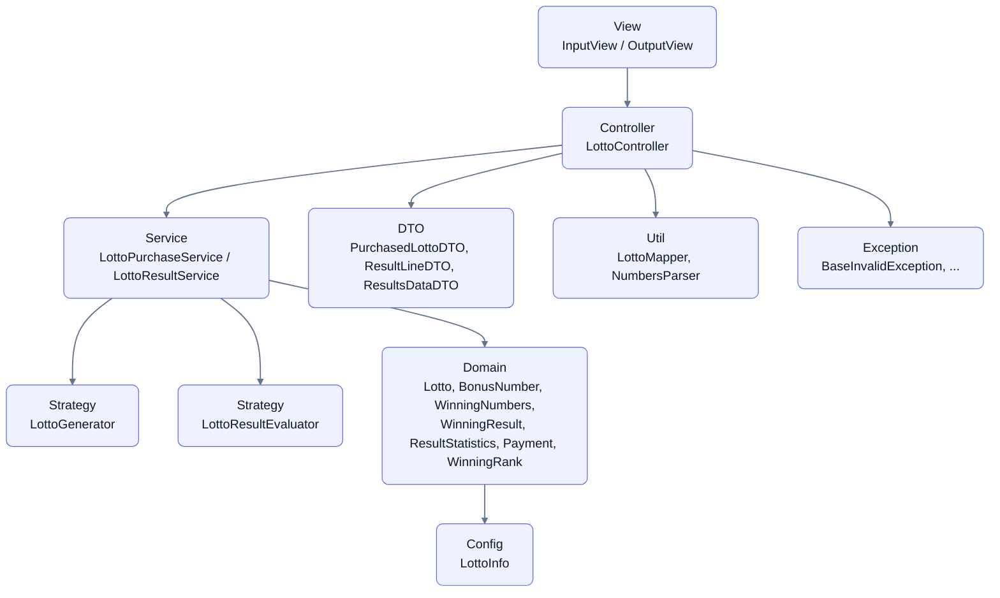

# java-lotto-precourse
## 과제 개요
간단한 로또 발매기를 구현한다.

- 로또 번호의 숫자 범위는 1~45까지이다.
- 1개의 로또를 발행할 때 중복되지 않는 6개의 숫자를 뽑는다.
- 당첨 번호 추첨 시 중복되지 않는 숫자 6개와 보너스 번호 1개를 뽑는다.
- 당첨은 1등부터 5등까지 있다. 당첨 기준과 금액은 아래와 같다.
    - 1등: 6개 번호 일치 / 2,000,000,000원
    - 2등: 5개 번호 + 보너스 번호 일치 / 30,000,000원
    - 3등: 5개 번호 일치 / 1,500,000원
    - 4등: 4개 번호 일치 / 50,000원
    - 5등: 3개 번호 일치 / 5,000원
- 로또 구입 금액을 입력하면 구입 금액에 해당하는 만큼 로또를 발행해야 한다.
- 로또 1장의 가격은 1,000원이다.
- 당첨 번호와 보너스 번호를 입력받는다.
- 사용자가 구매한 로또 번호와 당첨 번호를 비교하여 당첨 내역 및 수익률을 출력하고 로또 게임을 종료한다.
- 사용자가 잘못된 값을 입력할 경우 `IllegalArgumentException`을 발생시키고, "[ERROR]"로 시작하는 에러 메시지를 출력 후 그 부분부터 입력을 다시 받는다.
    - `Exception`이 아닌 `IllegalArgumentException`, `IllegalStateException` 등과 같은 명확한 유형을 처리한다.

### **입출력**
#### **입력**

- 로또 구입 금액을 입력 받는다. 구입 금액은 1,000원 단위로 입력 받으며 1,000원으로 나누어 떨어지지 않는 경우 예외 처리한다.

  ```
  14000
  ```

- 당첨 번호를 입력 받는다. 번호는 쉼표(,)를 기준으로 구분한다.

  ```
  1,2,3,4,5,6
  ```

- 보너스 번호를 입력 받는다.

  ```
  7
  ```
<br/>

#### **출력**

- 발행한 로또 수량 및 번호를 출력한다. 로또 번호는 오름차순으로 정렬하여 보여준다.

  ```
  8개를 구매했습니다.
  [8, 21, 23, 41, 42, 43]
  [3, 5, 11, 16, 32, 38]
  [7, 11, 16, 35, 36, 44]
  [1, 8, 11, 31, 41, 42]
  [13, 14, 16, 38, 42, 45]
  [7, 11, 30, 40, 42, 43]
  [2, 13, 22, 32, 38, 45]
  [1, 3, 5, 14, 22, 45]
  
  ```

- 당첨 내역을 출력한다.

  ```
  3개 일치 (5,000원) - 1개
  4개 일치 (50,000원) - 0개
  5개 일치 (1,500,000원) - 0개
  5개 일치, 보너스 볼 일치 (30,000,000원) - 0개
  6개 일치 (2,000,000,000원) - 0개
  
  ```

- 수익률은 소수점 둘째 자리에서 반올림한다. (ex. 100.0%, 51.5%, 1,000,000.0%)

  ```erlang
  총 수익률은 62.5%입니다.
  ```

- 예외 상황 시 에러 문구를 출력해야 한다. 단, 에러 문구는 "[ERROR]"로 시작해야 한다.

  ```prolog
  [ERROR] 로또 번호는 1부터 45 사이의 숫자여야 합니다.
  ```

### **실행 결과 예시**
```prolog
구입금액을 입력해 주세요.
8000

8개를 구매했습니다.
[8, 21, 23, 41, 42, 43]
[3, 5, 11, 16, 32, 38]
[7, 11, 16, 35, 36, 44]
[1, 8, 11, 31, 41, 42]
[13, 14, 16, 38, 42, 45]
[7, 11, 30, 40, 42, 43]
[2, 13, 22, 32, 38, 45]
[1, 3, 5, 14, 22, 45]

당첨 번호를 입력해 주세요.
1,2,3,4,5,6

보너스 번호를 입력해 주세요.
7

당첨 통계
---
3개 일치 (5,000원) - 1개
4개 일치 (50,000원) - 0개
5개 일치 (1,500,000원) - 0개
5개 일치, 보너스 볼 일치 (30,000,000원) - 0개
6개 일치 (2,000,000,000원) - 0개
총 수익률은 62.5%입니다.

```

--- 

## 프로젝트 구조
<details>
  <summary>전체 디렉토리 트리</summary>

```angular2html
lotto
├─ Application.java
├─ config
│  └─ LottoInfo.java
├─ controller
│  └─ LottoController.java
├─ domain
│  ├─ BonusNumber.java
│  ├─ Lotto.java
│  ├─ Payment.java
│  ├─ ResultStatistics.java
│  ├─ WinningNumbers.java
│  ├─ WinningRank.java
│  └─ WinningResult.java
├─ dto
├─ exception
├─ service
│  ├─ LottoPurchaseService.java
│  ├─ LottoResultService.java
│  ├─ lottogenerator
│  │  ├─ LottoGenerator.java
│  │  └─ RandomLottoGenerator.java
│  └─ lottoresultevaluator
│     ├─ LottoResultEvaluator.java
│     ├─ BooleanArrayBasedLottoResultEvaluator.java
│     └─ SetBasedLottoResultEvaluator.java
├─ util
│  ├─ LottoMapper.java
│  └─ NumbersParser.java
└─ view
   ├─ InputView.java
   └─ OutputView.java
```

</details>

###  패키지 계층 구조



### 각 클래스의 역할
| **클래스** | **역할**                                |
| --- |---------------------------------------|
| **Application** | 프로그램 시작점 (main)                       |
| **LottoController** | 전체 흐름 제어 (입력 → 처리 → 출력)               |
| **LottoPurchaseService** | 구매 금액을 로또 발행 장수로 변환, 그에 맞게 로또 생성      |
| **LottoResultService** | 당첨 판정, 집계 및 수익률 계산                    |
| **LottoGenerator** | 로또 번호 생성 전략 (중복 없이 6개 생성)             |
| **LottoResultEvaluator** | 로또와 당첨 번호를 비교하여 등수 평가                 |
| **Lotto** | 로또 한 장(숫자 6개) 모델. 숫자 중복·범위·개수 검증 및 정렬 |
| **BonusNumber** | 보너스 번호 값 객체. 범위(1~45) 검증              |
| **WinningNumbers** | 당첨 번호(메인 6개 + 보너스) 집합. 중복 검증          |
| **WinningRank** | 당첨 등수/상금 규칙 (Enum). 매칭 수에 따른 등수 반환    |
| **WinningResult** | 각 등수별 개수 집계 결과                        |
| **ResultStatistics** | 총 상금 및 수익률 계산                         |
| **Payment** | 구매 금액 값 객체. 최소 금액·1000원 단위 검증         |
| **PurchasedLottoDTO, ResultLineDTO, ResultsDataDTO** | View에 전달할 전용 데이터(DTO)                 |
| **InputView, OutputView** | 콘솔 입출력 계층                             |
| **LottoMapper** | 도메인 객체 ↔ DTO 매핑                       |
| **NumbersParser** | 문자열 → 정수 리스트 변환 (입력 파싱)               |
| **Exception 패키지** | 입력/도메인 검증 예외 정의 ([ERROR] prefix 관리)   |
| **LottoInfo** | 로또 상수값 관리 (최소/최대값, 개수, 가격 등)          |

---
## 프로그램의 기능 목록
### 비즈니스 로직
- [x] 로또의 구매액을 입력받는다.
  - [x] 1,000원 단위가 아니면 에러를 반환한다.
  - [x] 구매액은 양수여야 한다.
- [x] 로또를 생성한다.
  - [x] 각 로또의 숫자의 범위는 1~45로 제한된다.
  - [x] 각 로또는 중복되지 않은 6개의 숫자를 뽑는다.
  - [x] 로또를 생성할 때는 오름차순으로 정렬한다.
- [x] 로또를 발행한다.
  - [x] 구입 금액에 따른 발행 장수를 계산한다.
  - [x] 발행 장수에 맞게 로또를 생성한다.
- [x] 발행한 로또 번호를 출력한다.
  - [x] 구매한 로또의 개수를 출력한다.
  - [x] 로또를 보여줄 때는 오름차순으로 정렬하여 보여준다.
  - [x] [#, #, #, #, #, #] 형식으로 출력한다.
- [x] 로또의 당첨 번호를 입력받는다.
  - [x] 각 로또의 숫자의 범위는 1~45로 제한된다.
  - [x] 각 로또는 중복되지 않은 6개의 숫자를 뽑는다.
  - [x] 로또를 보여줄 때는 오름차순으로 정렬한다.(*로또 클래스 자체에서 오름차순으로 정렬할지, 뷰에서 정렬할지 선택한다.)
- [x] 로또의 보너스 번호를 입력받는다.
  - [x] 보너스 번호는 1~45의 숫자 중, 당첨번호와 중복되지 않는 수 중 하나를 입력받는다.
- [x] 각 로또의 당첨 판정을 진행한다.
  - [x] 당첨 조건을 작성한다.
  - [x] 구매한 로또와, 당첨번호를 대조한다. 당첨번호와 구매한 로또의 교집합 원소의 수를 계산한다.
  - [x] 교집합 원소의 수가 5개인 경우 보너스 번호가 포함되어있는지 확인한다.
- [x] 총 당첨된 액수를 계산한다.
- [x] 당첨된 액수에 대해 수익률을 계산한다.
- [x] 로또 당첨에 대한 결과를 출력한다.
  - [x] 당첨 내역을 출력한다. 
  - [x] 당첨조건 (당첨액) - 당첨 복권수 형식으로 5등부터 1등까지 오름차순으로 뵤여준다. 
  - [x] 수익률을 출력한다. 수익률은 소수점 둘째자리에서 반올림한다.
<br/>
  
### 그외 제약사항
- [x] 입력에서 예외가 발생하였을 때, `IllegalArgumentException`을 발생시킨다. (ExceptionHandling)
  - [x] 모든 예외 메시지는 [ERROR]로 시작한다.
  - [x] 예외가 발생하였을 때 발생한 시점부터 다시 입력을 받는다.
- [x] 코드의 깊이는 2이하로 작성한다.
- [x] else 예약어를 사용하지 않는다. switch case 도 금지한다.
- [x] 모든 함수의 길이는 15줄을 넘지 않는다.
  - [x] 단일책임을 갖도록 함수를 작성한다.
- [x] 각 도메인별로 테스트를 진행한다.

### 추가 제약사항
- [x] 로또 판매 시 구매 한도 금액을 설정한다.
  - 「복권 및 복권기금법 제3조」에 따라 1회 10만원을 초과 구매 불가